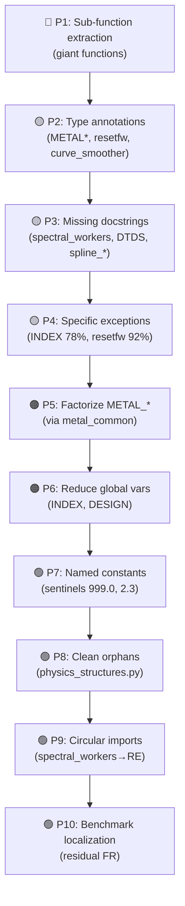

# 🔬 Ultra-Comprehensive Audit — CERTUS Suite v26_01

## Synthetic View

| Metric | Value |
|:---|---:|
| **Total LOC** (non-test Python) | **~90,000** |
| Main Modules (`CERTUS_*.py`) | 9 files |
| Helpers / Utilities | 34 files |
| Spline Pipeline Modules | 9 files |
| Test Files | 46+ files, **609 tests** collected |
| Total Classes (prod) | ~150+ |
| Total Functions (prod) | ~1,800+ |

---

## 1. Module Mapping (Descending Size)

### Main Monolithic Modules

| Module | LOC | Functions | Classes | Internal Deps |
|:---|---:|---:|---:|---:|
| [CERTUS_STRAT.py](file:///c:/driveFL/couches%20minces%202026/CERTUS/1004/CERTUS_STRAT.py) | **10,679** | 218 | 24 | 9 |
| [CERTUS_INDEX.py](file:///c:/driveFL/couches%20minces%202026/CERTUS/1004/CERTUS_INDEX.py) | **8,569** | 158 | 23 | 8 |
| [_certus_physics_impl.py](file:///c:/driveFL/couches%20minces%202026/CERTUS/1004/_certus_physics_impl.py) | **7,741** | 178 | 8 | 2 |
| [CERTUS_INDEX_SPLINE.py](file:///c:/driveFL/couches%20minces%202026/CERTUS/1004/CERTUS_INDEX_SPLINE.py) | **6,891** | 151 | 3 | 15 |
| [CERTUS_DESIGN.py](file:///c:/driveFL/couches%20minces%202026/CERTUS/1004/CERTUS_DESIGN.py) | **6,676** | 109 | 4 | 11 |
| [CERTUS_RE.py](file:///c:/driveFL/couches%20minces%202026/CERTUS/1004/CERTUS_RE.py) | **5,407** | 124 | 1 | 6 |
| [certus_ui.py](file:///c:/driveFL/couches%20minces%202026/CERTUS/1004/certus_ui.py) | **3,490** | 204 | 15 | 5 |
| [certus_re_workers.py](file:///c:/driveFL/couches%20minces%202026/CERTUS/1004/certus_re_workers.py) | **3,456** | 43 | 2 | 5 |
| [CERTUS_METAL_BILAYER.py](file:///c:/driveFL/couches%20minces%202026/CERTUS/1004/CERTUS_METAL_BILAYER.py) | **2,096** | 39 | 4 | 5 |

### High-Density Helpers

| Module | LOC | Functions | Classes |
|:---|---:|---:|---:|
| [certus_substrate_index.py](file:///c:/driveFL/couches%20minces%202026/CERTUS/1004/certus_substrate_index.py) | 2,741 | 92 | 4 |
| [spline_profile_corridors.py](file:///c:/driveFL/couches%20minces%202026/CERTUS/1004/spline_profile_corridors.py) | 2,558 | 30 | 1 |
| [certus_index_spline_core.py](file:///c:/driveFL/couches%20minces%202026/CERTUS/1004/certus_index_spline_core.py) | 2,068 | 54 | 4 |
| [certus_re_helpers.py](file:///c:/driveFL/couches%20minces%202026/CERTUS/1004/certus_re_helpers.py) | 1,628 | 61 | 2 |
| [spline_workers.py](file:///c:/driveFL/couches%20minces%202026/CERTUS/1004/spline_workers.py) | 1,458 | 16 | 1 |

---

## 2. Giant Functions (> 400 lines) — 🔴 Priority #1

> [!CAUTION]
> 20 functions exceed 400 lines. Each represents a major maintenance and testability risk, even within the intended monolithic context.

| Function | File | Lines |
|:---|:---|---:|
| `_show_smart_init_preview_dialog` | CERTUS_INDEX_SPLINE.py:2998 | **1,700** |
| `run` (DesignOptimWorker) | CERTUS_DESIGN.py:261 | **1,209** |
| `_execute_phase2_splines` | certus_re_workers.py:556 | **936** |
| `worker_spline_optimization` | spline_pipeline.py:132 | **862** |
| `fit_sellmeier` | certus_substrate_index.py:1081 | **842** |
| `_build_re_run_context` | certus_re_workers.py:2608 | **831** |
| `export_excel` | CERTUS_INDEX_SPLINE.py:5137 | **800** |
| `_execute_phase4_beam` | certus_re_workers.py:1692 | **734** |
| `_run_single_spline_stage` | spline_workers.py:825 | **633** |
| `run_final_simulation_block` | CERTUS_STRAT.py:2671 | **622** |
| `compute_profiled_corridors_by_d` | spline_profile_corridors.py:1991 | **566** |
| `_build_controls_basic_panel` | CERTUS_INDEX_SPLINE.py:957 | **524** |
| `run` (IndexOptimWorker) | CERTUS_INDEX.py:2855 | **517** |
| `_on_optim_done` | CERTUS_DESIGN.py:4512 | **473** |
| `_show_re_results_window` | CERTUS_RE.py:4160 | **442** |
| `_run_step_23_full` | CERTUS_STRAT.py:5549 | **439** |
| `run` (IndexSwanepoel) | CERTUS_INDEX.py:3659 | **420** |
| `update_data` | CERTUS_STRAT.py:4120 | **416** |
| `run` (SpectralFetchWorker) | certus_spectral_workers.py:115 | **382** |
| `_run_free_knot_stage` | spline_workers.py:378 | **377** |

**Recommendation**: Extract private sub-functions within the same file (no new module). Prioritize `_show_smart_init_preview_dialog` (1700L) and DESIGN's `run()` (1209L).

---

## 3. Type Annotations — 🟡 Priority #2

> [!IMPORTANT]
> The heterogeneity of type annotations makes the code difficult to analyze statically and creates a risk of silent bugs in internal interfaces.

### Parameter / Return Coverage

| Category | Typical Files | Param % | Return % |
|:---|:---|---:|---:|
| ✅ Excellent | `certus_errors.py`, `spline_finalize.py`, `certus_design_worker_utils.py` | 100% | 100% |
| ✅ Good | `_certus_physics_impl.py`, `certus_re_helpers.py`, `spline_*` | 75-100% | 77-100% |
| ⚠️ Insufficient | `CERTUS_INDEX.py`, `CERTUS_STRAT.py`, `CERTUS_DESIGN.py` | 26-43% | 19-28% |
| 🔴 Absent | `CERTUS_METAL_BILAYER.py`, `CERTUS_METAL_SINGLE.py`, `certus_curve_smoother.py` | 0-8% | 0-8% |

**Priority Files**: `CERTUS_METAL_BILAYER.py` (0%), `CERTUS_METAL_SINGLE.py` (3%), `certus_curve_smoother.py` (8%), `certus_reset_framework.py` (7%).

---

## 4. Docstrings — 🟡 Priority #3

| Category | Files | Coverage |
|:---|:---|:---|
| ✅ 80–100% | `certus_core`, `CERTUS_DESIGN`, `certus_errors`, `certus_re_helpers`, `CERTUS_RE` | Very good |
| ⚠️ 25–50% | `CERTUS_INDEX` (43%), `CERTUS_STRAT` (31%), `certus_re_workers` (33%), `certus_substrate_index` (34%) | Insufficient |
| 🔴 0–25% | `certus_spectral_workers` (0%), `certus_curve_smoother` (0%), `_build_html_report` (0%), `certus_smart_init_curve_editor` (8%), `CERTUS_INDEX_SPLINE` (24%), `CERTUS_DTDS` (25%), `spline_pipeline` (25%), `spline_workers` (44%) | Critical |

---

## 5. Error Handling — 🟡 Priority #4

> [!WARNING]
> 308 `except Exception` blocks across the codebase. Zero `bare except` is good — but excessive `broad Exception` hides bugs.

### Top Problematic Modules

| Module | `try` blocks | `except Exception` | Ratio |
|:---|---:|---:|---:|
| CERTUS_STRAT.py | 117 | 56 | 48% |
| CERTUS_INDEX.py | 104 | 81 | **78%** |
| CERTUS_INDEX_SPLINE.py | 54 | 19 | 35% |
| certus_ui.py | 45 | 29 | 64% |
| CERTUS_DESIGN.py | 39 | 27 | 69% |
| CERTUS_RE.py | 42 | 19 | 45% |
| certus_reset_framework.py | 12 | 11 | **92%** |

**Recommendation**: Gradually replace with specific exceptions (`ValueError`, `FileNotFoundError`, `KeyError`…), starting with critical optimization worker paths.

---

## 6. Code Duplication — 🟠 Priority #5

### Significant Duplicate Functions (Same Name, Different Files)

| Pattern | Affected Files | Impact |
|:---|:---|:---|
| `start_optimization` | METAL_BILAYER, METAL_SINGLE, metal_common | Shareable logic |
| `on_beam_finished`, `on_file_loaded`, `on_optimization_finished`, `on_optimization_error` | METAL_BILAYER + METAL_SINGLE | Identical pattern |
| `export_results` | DESIGN, INDEX, METAL_BILAYER, METAL_SINGLE | Duplicable export logic |
| `load_config` / `save_config` | DESIGN, INDEX, metal_common, certus_ui | Config serialization |
| `copy_logs_to_clipboard` | DESIGN, INDEX, STRAT | Identical |
| `reset_to_defaults` | DESIGN, INDEX_SPLINE, RE, reset_framework | |
| `stop_optimization` / `stop` | INDEX, METAL_*, metal_common | |
| `update_stats_display` / `on_stats_update` | DESIGN, metal_common, STRAT | |
| `callback` | DESIGN, DTDS, metal_common (×2) | Too generic names |

> [!TIP]
> METAL_BILAYER and METAL_SINGLE modules share maximum patterns. `certus_metal_common.py` already exists as a common base — more logic should be centralized there (~60% estimated duplicated code between the two METAL modules).

---

## 7. Global Variables — 🟠 Priority #6

| Module | `global` declarations |
|:---|---:|
| CERTUS_INDEX.py | 13 |
| CERTUS_STRAT.py | 9 |
| CERTUS_DESIGN.py | 8 |
| _certus_physics_impl.py | 6 |
| CERTUS_INDEX_SPLINE.py | 4 |
| certus_strat_context.py | 4 |

**Note**: `CERTUS_STRAT.py` has partially migrated to `StratContext` (dependency injection). Other modules have no equivalent mechanism.

---

## 8. Magic Numbers — 🟢 Priority #7

| File | Frequent example |
|:---|:---|
| `_certus_physics_impl.py` | `2.0` (125×), `0.0000` (77×), `4.0` (35×) |
| `CERTUS_STRAT.py` | `2.0` (35×), `999.0` (15×), `100.0` (13×) |
| `CERTUS_INDEX.py` | `2.0` (30×), `10.0` (25×), `2.3` (21×), `20.0` (21×) |

**Note**: Many are legitimate physical or UI constants (`2.0` = Cauchy formula, `999.0` = sentinel). Extracting sentinels into named constants would be sufficient.

---

## 9. Orphan Modules (Never Imported) — 🟢 Priority #8

| Module | LOC | Probable Status |
|:---|---:|:---|
| `_build_html_report.py` | 203 | Standalone utility |
| `certus_curve_smoother.py` | 342 | Standalone tool (GUI) |
| `certus_live_visualizer.py` | 333 | Standalone tool (GUI) |
| `certus_physics_structures.py` | 7 | Obsolete facade — **candidate for deletion** |
| `certus_pointwise_ir.py` | 341 | Standalone tool |
| `certus_substrate_index.py` | 2,741 | Standalone tool (GUI) |

---

## 10. Circular Imports — 🟢 Priority #9

- `certus_spectral_workers.py` imports `CERTUS_RE` → risk of cycle if `CERTUS_RE` indirectly imports `certus_spectral_workers`
- `certus_errors.py` self-imports (`from certus_errors import …`) — probably harmless but worth checking

---

## 11. Localization (FR → EN) — 🟢 Priority #10

### Files with Residual Accented Characters

| File | Accented Chars |
|:---|---:|
| benchmark_dTds_extrema.py | 95 |
| benchmark_dTds_pglobal_fast.py | 58 |
| spline_nonlinear_alpha.py | 58 |
| certus_design_worker_utils.py | 36 |
| spline_presets.py | 17 |
| study_rmse_dn_sigma_thickness.py | 8 |
| benchmark_dTds_extrema_jax.py | 4 |
| CERTUS_DTDS.py | 3 |
| certus_re_workers.py | 1 |

> [!NOTE]
> Main monolithic modules (STRAT, INDEX, DESIGN, RE, INDEX_SPLINE) are clean. Residues are in secondary benchmarks and utilities.

---

## 🎯 Improvement Priorities (Ranked by Impact/Effort)

### Recommended Action Summary

| # | Action | Effort | Impact | Monolithic Compatible |
|:--|:---|:---|:---|:---:|
| **P1** | Extract sub-functions in the 10 functions > 500L | Medium | 🔴 Very high | ✅ |
| **P2** | Add type hints in METAL_*, reset_framework, curve_smoother | Low | 🟡 High | ✅ |
| **P3** | Add docstrings in spectral_workers, DTDS, spline_pipeline | Low | 🟡 High | ✅ |
| **P4** | Replace `except Exception` with targeted exceptions (INDEX, resetfw) | Medium | 🟡 High | ✅ |
| **P5** | Consolidate METAL_BILAYER + METAL_SINGLE via metal_common | Medium | 🟠 Medium | ✅ |
| **P6** | Migrate `global` → context objects (like StratContext) | Med-High | 🟠 Medium | ✅ |
| **P7** | Extract sentinels (999.0, 2.3) into named constants | Low | 🟢 Low | ✅ |
| **P8** | Delete `certus_physics_structures.py` (7L, orphan) | Trivial | 🟢 Low | ✅ |
| **P9** | Eliminate `CERTUS_RE` import from `certus_spectral_workers` | Low | 🟢 Low | ✅ |
| **P10** | Translate FR residues in benchmarks / spline_presets | Low | 🟢 Low | ✅ |

---

## Codebase Strengths

- ✅ **Consistent Monolithic Architecture** — each `CERTUS_*.py` is self-sufficient, documented banner
- ✅ **609 tests** with target coverage 80% on shared libs
- ✅ **Zero `bare except`** — consistent exception discipline
- ✅ **Well-typed Helpers**: `certus_errors`, `spline_*`, `_certus_physics_impl` (66-100%)
- ✅ **Structured Spline Pipeline** (SOL2 → SOL3 → SOL3b → polish → corridors)
- ✅ **Structured JSON logging** in inversion pipeline
- ✅ **StratContext** for dependency injection (STRAT)
- ✅ **English Localization** almost complete on main modules
- ✅ **Mastered Dependencies** — 8 external packages, pinned versions
