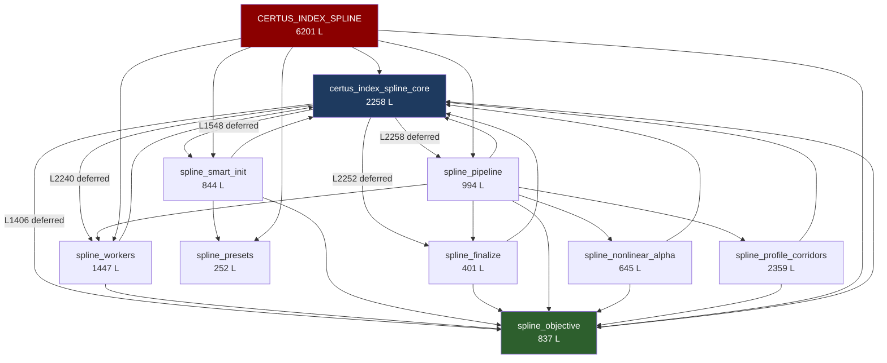

# CERTUS INDEX SPLINE — Professional Code & GUI Audit

**Date**: 2026-04-11  
**Scope**: `certus_index_spline_core.py`, `CERTUS_INDEX_SPLINE.py`, `spline_*.py` (11 modules)  
**Methodology**: Static analysis (AST), import graph, grep patterns, test execution, manual review  

---

## 1. Module Map & Metrics

| Module | File | Lines | Functions | Classes | Role |
|--------|------|------:|----------:|--------:|------|
| **Core** | [certus_index_spline_core.py](file:///c:/driveFL/couches%20minces%202026/CERTUS/1004/certus_index_spline_core.py) | 2,258 | 54 | 4 | Config, mesh, bounds, monotonicity, SMART diagnostic |
| **GUI** | [CERTUS_INDEX_SPLINE.py](file:///c:/driveFL/couches%20minces%202026/CERTUS/1004/CERTUS_INDEX_SPLINE.py) | 6,201 | 151 | 3 | PyQt6 application, plots, dialogs, worker integration |
| **Objective** | [spline_objective.py](file:///c:/driveFL/couches%20minces%202026/CERTUS/1004/spline_objective.py) | 837 | 23 | 1 | Masked spectral MSE, PWL nk, analytic gradient |
| **Pipeline** | [spline_pipeline.py](file:///c:/driveFL/couches%20minces%202026/CERTUS/1004/spline_pipeline.py) | 994 | 8 | 1 | SOL2→SOL3→SOL3b→polish→NL α→corridors orchestration |
| **Workers** | [spline_workers.py](file:///c:/driveFL/couches%20minces%202026/CERTUS/1004/spline_workers.py) | 1,447 | 16 | 1 | PGlobal + L-BFGS-B, live dict, stage packing |
| **SmartInit** | [spline_smart_init.py](file:///c:/driveFL/couches%20minces%202026/CERTUS/1004/spline_smart_init.py) | 844 | 16 | 0 | Swanepoel extrema, preview, material presets |
| **Finalize** | [spline_finalize.py](file:///c:/driveFL/couches%20minces%202026/CERTUS/1004/spline_finalize.py) | 401 | 6 | 0 | σ mesh polish (PWL / cubic), RMSE synthesis |
| **Presets** | [spline_presets.py](file:///c:/driveFL/couches%20minces%202026/CERTUS/1004/spline_presets.py) | 252 | 5 | 0 | Material presets (Nb₂O₅, SiO₂, Ta₂O₅) |
| **VisualUtils** | [spline_visual_utils.py](file:///c:/driveFL/couches%20minces%202026/CERTUS/1004/spline_visual_utils.py) | 78 | 2 | 0 | Clipboard TSV, plot snapshot |
| **NLAlpha** | [spline_nonlinear_alpha.py](file:///c:/driveFL/couches%20minces%202026/CERTUS/1004/spline_nonlinear_alpha.py) | 645 | 11 | 1 | Non-linearity α sweep + 2nd pass |
| **Corridors** | [spline_profile_corridors.py](file:///c:/driveFL/couches%20minces%202026/CERTUS/1004/spline_profile_corridors.py) | 2,359 | 28 | 1 | d profiling, bootstrap, LR corridors |
| **Total** | | **16,316** | **320** | **12** | |

---

## 2. Architecture & Dependency Graph



> [!WARNING]
> **Circular dependency**: `certus_index_spline_core.py` imports from `spline_objective`, `spline_workers`, `spline_smart_init`, `spline_finalize`, and `spline_pipeline` via **deferred module-level imports** at lines 1406, 1548, 2240, 2252, 2258. These are not inside functions — they are top-level `from ... import` statements placed after the functions they depend on. This works in CPython but is fragile, order-dependent, and blocks IDE analysis.

---

## 3. Top Issues Identified

### 3.1 `SplineOptConfig` Hyper-Bloat (90+ Fields)

The central dataclass [SplineOptConfig](file:///c:/driveFL/couches%20minces%202026/CERTUS/1004/certus_index_spline_core.py#L1207-L1373) has **90+ fields** spanning:
- Spectral data (lam_nm, t_exp, r_exp, n_sub)
- Bounds (d_lo, d_hi, k_clip_lo/hi)
- PGlobal budget (7 fields)
- Trust region (4 fields)
- n Monotonicity (6 fields)
- Smart Init (12 fields)
- RMSE window (3 fields)
- nk profile (3 fields)
- Corridor profiling (**28 fields**)
- Bootstrap (**12 fields**)
- Nonlinear alpha (4 fields)

**Impact**: Every worker, helper, and UI builder receives the full 90-field bag. Default values are mixed into the config rather than separated. Adding a new feature requires touching this single dataclass — high coupling, low cohesion.

### 3.2 GUI Monolith (6,201 Lines / 151 Functions)

`CERTUS_INDEX_SPLINE.py` is a **single class `CertusIndexSplineApp`** with 151 methods. It handles:
- UI construction (`_build_ui`, `_build_controls_basic_panel`, `_build_plot_tabs_panel`, etc.)
- Data loading & column detection
- Worker lifecycle (start, stop, progress, live updates)
- Smart Init preview dialog integration
- Result display (6+ plot tabs, data table, JSON export)
- Corridor visualization
- RMSE window overlay
- Undo/redo
- Advanced settings dialog with widget reparenting
- Persistent QSettings (8 keys)
- Live index monitor (detached window)

> [!IMPORTANT]
> The `_open_advanced_settings_dialog` method (L914–953) **reparents a live widget** from the main layout into a dialog, then reparents it back. This is technically valid but fragile — any crash in the dialog can orphan the widget tree.

### 3.3 Localization Gaps (~140 Remaining French Strings)

Despite localization work in conversations `b92e6aab` and `cdf99a60`, **~140 French strings** remain in `CERTUS_INDEX_SPLINE.py`:
- UI labels: `"Rapide"`, `"Activer"`, `"Heuristique"`, `"Lecture seule"`, `"Paramètres avancés"`
- Tooltips: `"Borne basse d (nm). Défaut SiO₂ mince..."`, `"Décoché : après validation..."`
- ComboBox items: `"résiduel"`, `"Percentile central"`
- Internal comments (less critical but inconsistent)

### 3.4 Bare `except Exception` Proliferation (60+ Occurrences)

| Module | Count |
|--------|------:|
| CERTUS_INDEX_SPLINE.py | 28 |
| spline_profile_corridors.py | 7 |
| spline_workers.py | 6 |
| spline_smart_init.py | 5 |
| spline_pipeline.py | 6 |
| Others | 8 |
| **Total** | **60+** |

Most swallow the exception silently (no logging), making debugging difficult. Several are in optimization callbacks where a specific `StopIteration` or `ValueError` would be appropriate.

### 3.5 Deferred Top-Level Imports in Core

As shown in §2, `certus_index_spline_core.py` has **5 deferred imports at module scope** (lines 1406–2258). These are not inside functions — they are executed when the module loads, but rely on their targets having already been partially loaded. This pattern:
- Breaks static analysis and IDE tooling
- Creates fragile load-order dependencies
- Makes `SplineOptConfig` definition (line 1207) depend on symbols that import back into `certus_index_spline_core`

---

## 4. Additional Observations

### 4.1 Test Coverage — Current State

```
8 passed, 1 skipped (spline-specific tests)
```
Tests covering the spline module:
- `test_smoke_certus_index_spline.py` — smoke import
- `test_spline_objective_decompose.py` — objective decomposition
- `test_penalized_spline.py` — n monotonicity penalties
- `test_canonical_spline_ir_extension.py` — IR knot extension
- `test_spline_rmse_lambda_window.py` — RMSE window masking
- `test_spline_pwl_analytic_gradient.py` — analytic gradient vs FD
- `test_smart_init_d_preserves.py` — Smart Init d preservation

> [!NOTE]
> No test covers the full `worker_spline_optimization` pipeline end-to-end. The `conftest.py` provides fixtures (`synthetic_SiO2_spectrum`, `spline_cfg_factory`) that enable it.

### 4.2 Performance Notes

- `SplinePWLObjective` uses a **process-local cache** (`_weights_cache_key/arr`) for spectral weights — effective but not thread-safe if multiprocessing is used within a process.
- `_polish_lbfgsb_chunked` imports `time` inside the function (L209) — already imported at module level.
- `n_mono_segment_flags` (L205-228) and `n_lambda_rising_with_wavelength_penalty` (L231-273) use **Python loops** over segments/knots (typically K=12-14). Vectorizable but not critical at this scale.
- `rmse_by_sigma_segments` re-masks finite values; the mask is already applied by the caller in most paths — minor redundancy.

### 4.3 Code Style Consistency

- Comments mix French and English within the same function
- Some in-line comments use `#` with French abbreviations (`cf.`, `i.e.`, `ex:`)
- `SplineOptConfig` field comments are a mix of French and English
- Pipeline log messages mix French (`"terminé"`, `"entrée"`) with English

### 4.4 No `TODO/FIXME/HACK` Markers

Zero `TODO`, `FIXME`, `HACK`, `XXX`, or `WORKAROUND` markers found in any of the 11 spline modules. This suggests either very clean code or undocumented technical debt.

---

## 5. Proposed Refactoring Roadmap (5 Phases)

Each phase is independently shippable and reversible. No API changes without explicit approval.

### Phase 1 — `SplineOptConfig` Decomposition
**Risk: Low | Impact: High | Effort: ~2h**

Split the monolithic dataclass into nested sub-configs:
- `CorridorConfig` (28 fields → separate dataclass, already has `ProfileCorridorConfig` in corridors module)
- `BootstrapConfig` (12 fields)
- `NLAlphaConfig` (4 fields)
- `SmartInitConfig` (12 fields)
- `PGlobalBudgetConfig` (7 fields)

Keep a `SplineOptConfig` facade that composes these for backward compatibility.

### Phase 2 — Import Graph Linearization
**Risk: Low | Impact: Medium | Effort: ~1h**

Move the 5 deferred imports in `certus_index_spline_core.py` (L1406–2258) into functions that use them, or extract the re-exported symbols into a thin `_spline_api.py` re-export module. Goal: `certus_index_spline_core` has zero downstream imports at module scope.

### Phase 3 — GUI Extraction
**Risk: Medium | Impact: High | Effort: ~4h**

Extract from `CertusIndexSplineApp` (6,201 lines):
1. **`_spline_gui_controls.py`** — `_build_controls_basic_panel`, `_build_plot_tabs_panel`, advanced settings dialog
2. **`_spline_gui_worker.py`** — `_on_run`, `_on_stop`, `_on_worker_done`, `_on_live_update`, progress coordination
3. **`_spline_gui_display.py`** — `_plot_result_*`, `_refresh_data_table`, corridor visualization

Keeps `CertusIndexSplineApp` as a thin orchestrator (~500 lines).

### Phase 4 — Localization Completion
**Risk: Low | Impact: Medium | Effort: ~1.5h**

Translate remaining ~140 French strings in `CERTUS_INDEX_SPLINE.py`:
- UI labels, tooltips, combo items
- Pipeline log messages in `spline_pipeline.py` and `spline_workers.py`
- `SplineOptConfig` field comments

### Phase 5 — Exception Tightening
**Risk: Low | Impact: Medium | Effort: ~2h**

Replace 60+ bare `except Exception` with:
- `except (ValueError, TypeError)` for data validation
- `except StopIteration` for optimization cancellation callbacks
- `except OSError` for file I/O
- Add `logger.debug(exc_info=True)` to genuinely catch-all handlers

---

## 6. Verification Plan

### Automated Tests
```bash
# Full spline test suite
python -m pytest tests/test_smoke_certus_index_spline.py tests/test_spline_objective_decompose.py tests/test_penalized_spline.py tests/test_canonical_spline_ir_extension.py tests/test_spline_rmse_lambda_window.py tests/test_spline_pwl_analytic_gradient.py tests/test_smart_init_d_preserves.py -x -v

# Broader suite (gradient, corridors, sol2)
python -m pytest tests/ -k "spline" -x -v
```

### Manual Verification
- Launch GUI: `python CERTUS_INDEX_SPLINE.py` — verify no import error, window renders
- Load a spectrum, run optimization, verify live plots and final RMSE display
- Open Advanced Settings dialog — verify widget reparenting works both ways
