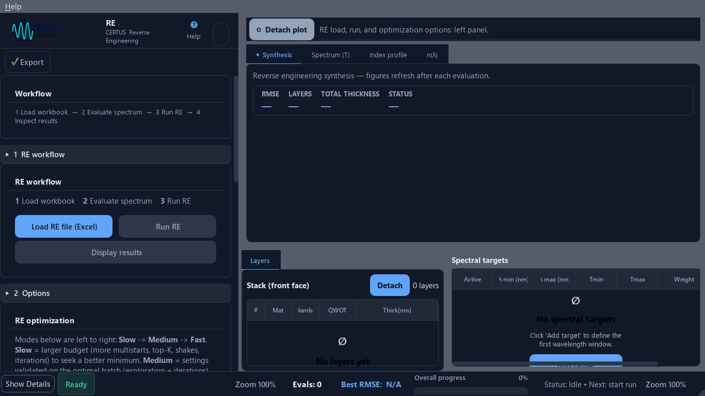

# Audit UX de CERTUS — 2 octobre 2026

**Conclusion : CERTUS dispose d'un socle d'interface cohérent, mais son UX reste celle d'un outil pour utilisateur déjà formé. Les priorités sont la fiabilité des messages, la protection du travail et la lisibilité sur petit écran. Une refonte graphique générale n'est pas nécessaire pour traiter ces problèmes.**

Ce jugement repose sur le code, des fenêtres Qt exécutées et des captures, pas sur une étude avec des utilisateurs. Aucune note chiffrée de satisfaction ou de facilité d'apprentissage n'a été mesurée.

## Périmètre et méthode

Le catalogue courant contient **dix modules, et non neuf**, en plus du hub : DESIGN, STRAT, RE, INDEX, INDEX SPLINE, FIELD, METAL SINGLE, METAL BILAYER, SMOOTHER et SUBSTRATE INDEX. Les onze fenêtres sont incluses. Source : `certus/core/certus_hub_config.py`, `HUB_APP_CATALOG`.

- Arbre examiné : branche `refactor-corridors-mixins`, HEAD `609ba2e9`. Deux modifications préexistaient : `.github/workflows/tests.yml` et `reports/controle_random75/ASSEMBLAGE_r75.json`. L'audit n'a pas édité ces fichiers.
- Préflight : `py scripts\preflight.py` → `PREFLIGHT=GO`, lint propre. La commande `python` n'est pas disponible dans le terminal ; `py` résout Python 3.14.7.
- **Installation courante bloquée** : `pydantic 2.14.0a1` exige `pydantic-core 2.47.0`, mais `2.49.0` est installé. Les sept premières fenêtres essayées échouent avant affichage ; les essais avec cet environnement ont été arrêtés. Trace conservée dans `erreurs_environnement_initial.json`. Le préflight importe le calcul optique, mais ne vérifie pas ce chemin d'import GUI.
- Pour poursuivre l'observation, seules les deux versions inscrites dans `requirements.lock`, `pydantic 2.13.5` et `pydantic-core 2.46.5`, ont été installées dans un **dossier temporaire isolé** puis prioritaires dans le chemin d'import. L'installation système et les fichiers de dépendances du projet restent inchangés. Les autres versions utilisées sont celles du poste : PyQt6 6.11.0, NumPy 2.5.3, SciPy 1.18.1, Numba 0.68.0. Ce n'est donc pas une validation de tout le verrou.
- **22 mesures**, un processus par fenêtre et résolution, avec le harnais `scripts/audit_ux_certus.py` : 1920×1080 et 1366×768, police Segoe UI 10 pt, plateforme Qt `offscreen`, préférences isolées. Les 22 processus terminent avec le code 0 et déclarent un squelette stable.
- **40 captures initiales** : clair et sombre pour les neuf fenêtres avec bascule ; clair pour les deux utilitaires sans bascule trouvée. **12 captures complémentaires** après fermeture du tutoriel sur six applications. Total : 52 PNG.
- **40 tests UX existants exécutés**, tous passants. Des sondes supplémentaires reproduisent le routage des fichiers, le faux succès de chargement, la garde de fermeture et le branchement d'Échap.

Les captures montrent le rendu Qt hors écran. Les cartes imbriquées de STRAT et METAL présentent des zones vides alors que leurs contrôles existent et ont des géométries ; **ce point reste à confronter au rendu natif Windows et n'est pas présenté comme un défaut de production établi**. Des captures initiales incluent le préchauffage JIT ou le tutoriel. Aucun temps de lancement, taux de réussite utilisateur, comportement à 150/200 % de mise à l'échelle, lecteur d'écran réel ou optimisation scientifique complète n'a été mesuré ici. Le binaire gelé n'a pas été testé.

## Priorités

P1 : perte de confiance, risque pour le travail ou blocage d'accès. P2 : difficulté récurrente dans un parcours. P3 : amélioration de confort. « Reproduit » désigne une sonde exécutée ; « code » une chaîne relue ; « visuel » une capture examinée ; « recommandation » un jugement UX.

| ID | Priorité | Constat et conséquence | Preuve | Correction proposée / critère d'acceptation |
|---|---|---|---|---|
| A01 | P1 | L'installation actuelle échoue avant l'interface, malgré un préflight vert. Un utilisateur ne peut pas accéder à son travail. | Reproduit : incompatibilité pydantic ; sept fenêtres essayées. | Réparer l'environnement séparément, puis ajouter un contrôle d'import des dépendances GUI au préflight. Un environnement incompatible doit produire un diagnostic explicite avant le lancement. |
| A02 | P1 | FIELD affiche **« Fichier chargé » après un chargement refusé**. Le dernier message contredit l'erreur et laisse croire que les données ont changé. | Reproduit sur un JSON contenant seulement `{` ; sonde `probe_CERTUS_FIELD.json`. | Faire remonter un succès/échec explicite du chargement ; aucun toast de succès après une erreur, une annulation ou un format rejeté. Vérifier aussi les autres utilisateurs du routeur commun. |
| A03 | P1 | La fermeture protège un calcul actif, mais **pas une configuration modifiée au repos**. | Reproduit sur la garde FIELD après modification de `lcalc` ; code de fermeture et de persistance relu. | Suivre les changements depuis le dernier enregistrement ; proposer Enregistrer / Fermer sans enregistrer / Annuler. Ne pas confondre les préférences de fenêtre avec une sauvegarde scientifique. |
| A04 | P2 | Le hub choisit le module d'un fichier **d'après son nom et son extension**. Un fichier valide peut ouvrir le mauvais outil. | Reproduit : `metal_bilayer_config.json` → METAL SINGLE ; `config_RE.json` → DESIGN ; `mesures_RE.xlsx` → INDEX. | Lire un identifiant de module dans les configurations ; en cas d'ambiguïté, proposer « Ouvrir avec… ». Pour un classeur, demander sa destination si son contenu ne permet pas de trancher. |
| A05 | P2 | Des titres deviennent **noirs sur fond sombre** ; les descriptions des états vides/tutoriels sont très pâles en clair. | Visuel et palette Qt : titres RE et tutoriels à `#000000` en sombre, texte secondaire à `#b8b8b8`. | Remplacer les couleurs de palette natives de ces composants par les jetons de thème appropriés, ou synchroniser réellement la palette. Tester les pixels/valeurs résolues dans les deux thèmes, y compris le fond hérité. |
| A06 | P2 | Les petits écrans compressent la lecture scientifique et des commandes. | Mesuré : STRAT 59,6 % de largeur de zone droite ; METAL SINGLE 442 px nécessaires pour 394 disponibles, BILAYER 453 pour 394. DESIGN ne montre qu'une petite partie de sa pile par défaut à 1366×768. | Réorganiser les panneaux en sections et lignes adaptatives. Garder les commandes principales visibles. Ne pas simplement rétrécir STRAT : cela masquerait ses réglages. |
| A07 | P2 | FIELD n'a pas le même contrat d'arrêt que les modules utilisant la confirmation commune : **Échap appelle directement `stop_all`**. | Signal du QShortcut réel émis, arrêt intercepté : un appel, aucune boîte de confirmation. | Harmoniser le contrat d'arrêt et préciser « arrêt demandé », « arrêté avec résultat partiel » ou « résultat conservé ». Tester le raccourci effectivement relié, pas seulement la présence de la touche. |
| A08 | P2 | FIELD qualifie des fins normales de recherche d'**erreurs** et perd la raison de certains paramètres invalides. | Code : `Error: Stagnation`, `Error: No needle insertion found`, deux `except ValueError` ramenés à `Failed to get parameters` ; défaut D60 voisin déjà connu. | Distinguer convergence/stagnation/budget/annulation/erreur. Montrer le motif concret du refus et le champ à corriger ; conserver le meilleur résultat dans le message de fin. |
| A09 | P2 | Les premiers pas n'indiquent pas toujours clairement quoi choisir, charger ou faire ensuite. | Visuel : hub composé de noms/icônes ; STRAT accueille par « Welcome to CERTUS » ; tutoriel générique de FIELD/INDEX SPLINE ; duplication des indications de workflow dans RE. | Ajouter une phrase orientée tâche sous les entrées du hub, un exemple ouvrable et une prochaine action dans les écrans vides. Conserver les noms scientifiques et les accès rapides pour les habitués. |
| A10 | P2 | Le vocabulaire varie entre modules ; INDEX SPLINE mélange français, anglais et noms proches de variables. | Visuel : `Synthèse (Overview)`, `Corridors_RMSE(d)`, `Mesh_optimizer`, `Data TH`, `d_nominal`, titres de courbes français. | Choisir une langue principale cohérente, développer les abréviations dans l'aide et utiliser des libellés métier. Regrouper paramètres essentiels et avancés sans masquer le modèle choisi. |
| A11 | P2 | SMOOTHER masque par défaut les données brutes ; SUBSTRATE INDEX sélectionne les colonnes par des conventions de nommage. Ces décisions demandent une vérification facile. | Code : `chk_raw.setChecked(False)` ; `load_file` filtre les colonnes et journalise celles écartées. | SMOOTHER : comparaison brut/lissé immédiatement accessible, résultat nommé « lissé ». SUBSTRATE : récapitulatif des colonnes retenues/exclues et motifs, avec aide au nommage ; préserver les gardes contre les mesures de film. |
| A12 | P3 | L'onglet promotionnel « Why CERTUS? » reste dans la zone de résultats de DESIGN. | Code et capture ; D59 déjà connu. | Déplacer son contenu vers Aide/À propos après arbitrage du propriétaire. L'espace principal doit servir au composant et à ses résultats. |

## Preuves détaillées des risques principaux

### A02 — succès de chargement trompeur

La sonde utilise une vraie fenêtre FIELD avec des préférences isolées, appelle le chemin de dépôt de fichier et acquitte la boîte d'erreur en interception. Elle n'importe aucune donnée utilisateur.

```text
error_dialogs:
  Failed to load configuration: Expecting property name enclosed in double quotes: line 1 column 2 (char 1)
toasts:
  level: success
  text: Fichier chargé : invalide_field.json
```

Chaîne relue : `CertusAppRunMixin._handle_dropped_file` dans `certus/ui/certus_base_app_run_mixin.py` appelle `load_config`, puis annonce systématiquement le succès. `CertusAppConfigMixin.load_config` est décoré par `safe_ui_action` dans `certus/ui/certus_ui_utils.py` : le décorateur affiche l'erreur puis rend `None`, sans propager l'échec. L'annonce finale est donc fausse. Le défaut est reproduit dans FIELD ; son extension à chaque autre module n'a pas été exécutée.

### A03 / A07 — deux protections différentes

```text
unsaved_idle_close_guard:
  before: 1064.0
  edited: 1234.0
  workers_running: 0
  close_allowed: true
  prompts: []
escape_action:
  shortcuts: 1
  stop_calls: [stop_all]
  confirmation_dialogs: []
```

La sonde de fermeture interroge la garde réelle ; elle ne prétend pas mesurer une restauration complète après fermeture/réouverture. Le code confirme la limite : `CertusAppRunMixin.confirm_close_during_run` accepte immédiatement lorsqu'aucun worker ne tourne ; `CertusBaseApp.closeEvent` sauvegarde les géométries/états via `_qs_save`, pas la configuration scientifique. Dans `CertusFieldApp.__init__`, Échap est relié à `_stop_all_workers`. L'arrêt a été intercepté pour éviter d'interrompre un vrai calcul.

### A05 — pourquoi le contrôle automatique reste vert

`certus/ui/certus_empty_state.py` et `certus/ui/certus_onboarding.py` emploient `palette(text)` et `palette(mid)`. Dans les captures et palettes interrogées, ces valeurs ne suivent pas correctement le fond du thème : les titres restent noirs. Le logo sombre devient également peu visible ; constat visuel secondaire, sans mesure de contraste du logo.

Le contrôle `sheet_contrast_pairs` de `scripts/audit_ux_certus.py` ne mesure que les règles où une encre **et** un fond explicites sont tous deux décodables. Il ne résout pas ces couleurs de palette avec leur fond hérité. Ainsi `low_contrast_dark = []` ne prouve pas que tous les textes sont lisibles.



## Audit module par module

| Écran | Points utiles à conserver | Friction principale / action recommandée |
|---|---|---|
| **CERTUS HUB** | Dix entrées regroupées, identité par famille, accès aux récents et aux journaux. | Très peu d'information métier sans survol : INDEX, INDEX SPLINE et les deux METAL demandent une connaissance préalable. Ajouter la tâche et l'entrée attendue ; fiabiliser l'ouverture par fichier (A04). |
| **DESIGN** | Ordre matériaux → pile → réglages ; Save/Load/Export ; synthèse et annulation de la pile. | À 1366×768, le panneau est dominé par les matériaux ; actions de calcul sous le défilement, pile et cibles très comprimées. Rendre l'action principale fixe, favoriser le spectre/résidu avec la synthèse, déplacer « Why CERTUS? » (A06/A12). |
| **STRAT** | Indicateurs SEEL, robustesse, taux d'échec et nombre de stratégies en tête ; actions Run/Stop fixes ; séparation Advanced/Multi-seed. | Panneau de configuration large et accueil sans prochaine action. Prévoir un exemple et un résumé des conditions du run ; distinguer résultat exploratoire et stratégie retenue. Ratio à petit écran à traiter par réorganisation, pas par réduction forcée (A06/A09). Les résultats d'un run complet n'ont pas été évalués ici. |
| **RE** | Chargement Excel clairement identifié, Run indisponible tant que les prérequis manquent, tableaux pile/cibles proches des résultats. | Workflow expliqué deux fois ; texte sur Slow/Medium/Fast encombrant ; grande synthèse vide. Résumer les budgets en une ligne puis fournir le détail à la demande, guider vers le classeur d'exemple, corriger les états vides sombres (A05/A09). |
| **INDEX** | Entrée spectrale et choix de substrat compréhensibles ; tutoriel propre au module ; champs avec unités. | Bouton Stop sous la ligne de flottaison à 1920×1080 dans la capture initiale ; mode normalisé actif à expliquer au point de saisie. Dans le code, `stop_optimization` annonce `Cancelled` avant les attentes d'arrêt, puis revient à `Stopping...` : rendre les états cohérents avec la fin réelle. La latence d'arrêt n'a pas été mesurée. |
| **INDEX SPLINE** | Vue réunissant spectre et indices ; guide en étapes ; accès aux corridors et données. | Guide et nombreux onglets se concurrencent, légendes parfois tronquées à 1366 px, jargon et langues mélangés. Distinguer réglage initial, ajustement et analyse d'incertitude ; conserver les vues avancées accessibles (A09/A10). |
| **FIELD** | Vue simultanée champ/spectre/profil ; unités physiques présentes ; configuration enregistrable. | Priorité aux faux messages de succès, à la fermeture et à Échap ; nommer correctement la fin de synthèse. Fixer les commandes de calcul/arrêt dans une zone toujours visible (A02/A03/A07/A08). |
| **METAL SINGLE** | Run/Halt fixes, onglets de spectre/indices/convergence, substrat transparent annoncé. | Le panneau ne reçoit pas sa largeur nécessaire à 1366 px ; le libellé Clear/Reset est coupé dans la capture. Mieux séparer données, hypothèses physiques et budgets, et distinguer clairement les observables R/T/Rback (A06). |
| **METAL BILAYER** | Structure proche de SINGLE, onglet du diélectrique ; cohérence utile aux opérateurs. | Même problème de largeur, avec davantage de réglages. Afficher un schéma/texte concis de l'empilement métal/SiO₂/silicium et les paramètres fixés/libres ; le nom et la couleur communs ne suffisent pas à choisir le bon modèle (A04/A06/A09). |
| **SMOOTHER** | Parcours court charger → niveau → enregistrer ; état vide explicite ; sauvegarde distincte `_clean.xlsx` et confirmation si l'original est choisi. | « Medium » ne dit pas l'effet sur le spectre et les traces brutes sont masquées par défaut. Faciliter la comparaison et expliquer le traitement avant export (A11). Le contraste pâle de certains axes est visible dans la capture, non quantifié. |
| **SUBSTRATE INDEX** | Bornes en nm, export JSON, distinction entrées/sorties/tableaux ; refus explicite si aucune colonne de substrat nu n'est trouvée. | La longue règle de nommage est une charge d'apprentissage. Montrer le diagnostic colonne par colonne et un exemple ; remplacer le graphe initial nu par une action de chargement contextualisée (A09/A11). |

## Mesures automatiques et portée des tests

« Zone droite » ci-dessous est la largeur allouée par le splitter ; ce n'est pas une mesure de pixels de courbes effectivement tracées. Les seuils sont ceux du projet, pas une note UX universelle.

| Fenêtre | Zone droite à 1920 | Zone droite à 1366 | Signalement du harnais |
|---|---:|---:|---|
| HUB | sans objet | sans objet | aucun |
| DESIGN | 73,9 % | 66,0 % | onglet promotionnel, aux deux tailles |
| STRAT | 71,0 % | 59,6 % | sous le seuil interne de 65 % à 1366 |
| RE | 73,9 % | 66,0 % | aucun |
| INDEX | 71,5 % | 66,0 % | aucun |
| INDEX SPLINE | 72,4 % | 72,5 % | aucun |
| FIELD | 79,1 % | 70,6 % | aucun |
| METAL SINGLE | 71,1 % | 71,0 % | panneau : 442 px nécessaires / 394 disponibles à 1366 |
| METAL BILAYER | 71,1 % | 71,0 % | panneau : 453 px nécessaires / 394 disponibles à 1366 |
| SMOOTHER | sans objet | sans objet | aucun |
| SUBSTRATE INDEX | sans objet | sans objet | aucun |

Source brute : `mesures.json`. **1 fenêtre sur 11 signalée à 1920×1080 ; 4 sur 11 à 1366×768.** Les observations D59/D61 antérieures se retrouvent. Le harnais ne trouve pas de raccourci vital manquant ni de nom accessible manquant parmi les catégories de contrôles qu'il parcourt. Il ne s'agit pas d'une certification d'accessibilité : par exemple les tuiles personnalisées du hub ne font pas partie de `interactive_controls`, et la présence d'un raccourci ne prouve pas son contrat d'action.

Tests exécutés :

```text
py -m pytest tests/ui/test_ux_stop_confirmation.py tests/ui/test_ux_close_during_run.py
  tests/ui/test_ux_hub_commands_do_something.py tests/ui/test_ux_sorting_never_corrupts_data.py
  tests/ui/test_ux_numeric_field_validators.py tests/ui/test_ux_progress_bar_reaches_the_end.py
  tests/ui/test_ux_empty_state_sync.py -q --no-cov

40 passed in 135.10s (0:02:15)
```

La commande est présentée sur plusieurs lignes pour lecture ; le fichier `tests_cibles.txt` conserve la sortie. Le chemin des dépendances temporaires était fourni dans `PYTHONPATH`.

Ces tests confirment notamment que l'inaction dans la confirmation d'arrêt conserve le run, que la fermeture FIELD/STRAT peut être refusée pendant un calcul, que le tri ne mélange pas certaines données et que les états vides suivent leurs tableaux. Ils ne testent pas le faux succès A02, la fermeture d'une configuration modifiée au repos, l'effet d'Échap de FIELD ni les couleurs de palette A05. **Tests verts et défauts UX peuvent donc coexister sans contradiction.** La suite complète n'a pas été relancée pour cet audit sans modification applicative.

Vérification finale : `py -m ruff check .` → `All checks passed!`, après tri manuel des imports des scripts de reproduction. Les contrôles `coherence_md.py`, `check_claude_md.py` et `check_docs.py` ne signalent aucun défaut mécanique dans leurs périmètres documentaires ; cela ne valide pas le jugement UX ni toutes les phrases du rapport.

## Ordre de traitement proposé

1. **Rétablir un lancement fiable**, puis supprimer les succès trompeurs de chargement. Cas d'acceptation : fichier valide, invalide, annulé, mauvais module, fichier renommé.
2. **Protéger le travail** : configuration modifiée, fermeture pendant calcul, Échap, arrêt partiel. Vérifier les boutons et raccourcis réels de chaque module.
3. **Corriger les composants communs** : états vides, tutoriels, couleurs résolues, messages de fin et accès permanent aux actions. Un petit correctif partagé aura plus d'effet qu'une refonte indépendante des onze fenêtres.
4. **Adapter les panneaux à 1366×768**, avec vérification native à 100/150/200 % et grand écran. Commencer par METAL puis STRAT, puis la répartition pile/cibles de DESIGN et RE.
5. **Guider le choix et la première réussite** : hub orienté tâches, un exemple par module, explication de l'entrée et du résultat attendu, vocabulaire stable et statut « modifié depuis le dernier calcul » lorsque pertinent.

Après ces corrections, une session utilisateur courte devrait mesurer trois parcours : novice choisissant le bon outil, expert modifiant une configuration, opérateur interrompant un calcul puis exportant le résultat conservé. Mesurer le temps, les erreurs de destination, les retours en arrière et la compréhension du statut. Aucun de ces résultats utilisateurs n'est anticipé ici.

## Livrables et limites de cette intervention

- Rapport : `AUDIT_UX.md` ; mesures : `mesures.json` ; tests : `tests_cibles.txt`.
- Sondes : `probe_routage.json`, `probe_CERTUS_*.json` ; les journaux `*.log` restent locaux (ignorés par Git).
- Captures : `CERTUS_*_<résolution>_<thème>.png` et variantes `sans_tutoriel`.
- Scripts de reproduction : `audit_capture.py`, `audit_probes.py`. Ils utilisent le harnais du dépôt et l’interpréteur Python 3.14 équipé des dépendances de CERTUS. Leur sortie vise ce dossier : les relancer seulement sur une copie si les preuves de cet audit doivent être conservées.

**Aucun code applicatif, calcul, fichier de dépendances ou préférence utilisateur n'a été corrigé. Aucun commit, push ou publication.** Le rapport et le registre `docs/ETAT.md` sont les documents ajoutés/modifiés pour cette demande. Les arbitrages d'interface préexistants restent des décisions du propriétaire ; cet audit fournit les éléments pour les prendre.

## Suite donnée (2026-10-02, après le rapport)

Les constatations A01 à A12 ont été corrigées localement, sans commit ; le détail, les mesures et les limites sont dans `docs/ETAT.md` (R102 et les lignes D59, D60, D61, D78 à D87). Ce que la vérification a trouvé de plus, ou de différent :

- **A02** touchait aussi RE (qui rendait `False` sans qu'on le lise), STRAT, et six gestionnaires de dépôt ; un spectre déposé sur INDEX passait par le lecteur de configuration.
- **A04** : FIELD, INDEX SPLINE et RE ignoraient le fichier que le hub leur donne.
- **A07** touchait aussi INDEX SPLINE, et l'arrêt d'une optimisation FIELD laissait la fenêtre bloquée (boutons désactivés, curseur d'attente).
- **A08** : « Error: Max layers reached » était un troisième cas ; le curseur d'attente restait posé après une synthèse.
- **A09** : le tutoriel d'INDEX SPLINE ne démarrait jamais (clé du catalogue `CERTUS-INDEX-SPLINE`, fenêtre `CERTUS_INDEX_SPLINE`).
- **A10** : « Mesh_optimizer » et « Corridors_RMSE(d) » étaient une esperluette lue comme mnémonique Qt (et le raccourci Alt+Espace enregistré trois fois), pas des noms de variables.
- Le rapport nommait `CertusAppRunMixin` la classe `CertusAppRunStateMixin`.
